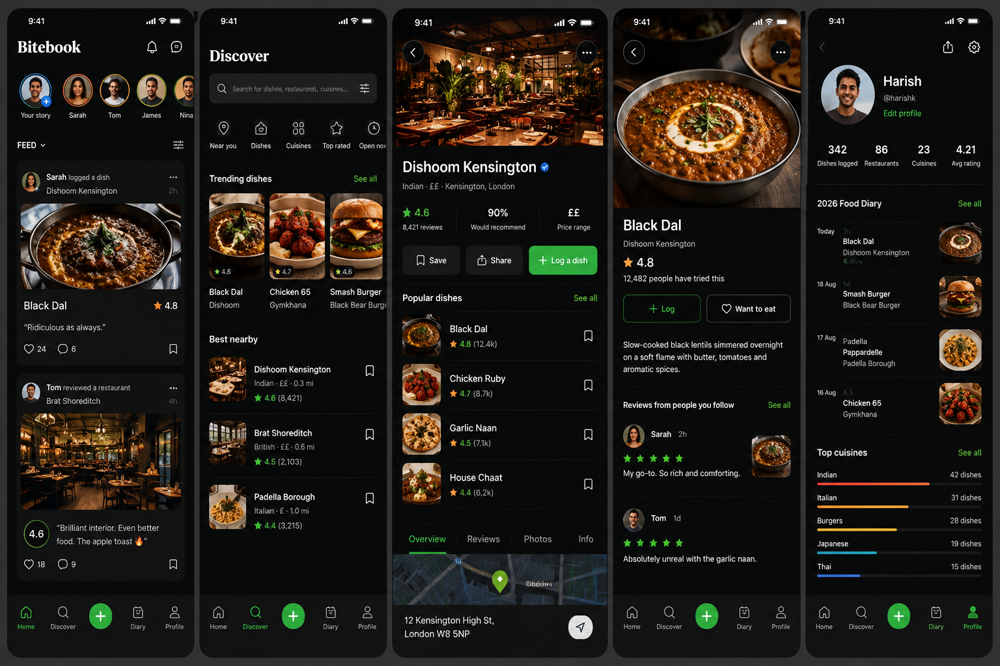

# BITEBOOK — AI BUILD INSTRUCTIONS
## Food diary + social discovery app
### Purpose
Build a production-quality mobile app inspired by the social discovery mechanics of Letterboxd, but for food. The product should feel like a premium combination of a food diary, restaurant discovery app, social network, and personal recommendation engine.

Working name: **Bitebook**
Tagline: **Log it. Rate it. Remember it.**

The core idea is NOT to make another Yelp/Tripadvisor clone. The core object is the **dish**. Users discover dishes, log what they ate, rate it, review it, save dishes/restaurants to a Want to Eat list, follow friends, create lists, and build a personal food history.

---

# 1. NON-NEGOTIABLE PRODUCT PRINCIPLES

1. Dish-first, restaurant-second.
2. Logging a meal should take less than 30 seconds.
3. Food photography should be visually dominant.
4. The product must feel social, not like a directory.
5. The UI must feel premium, modern, dark, image-first and mobile-native.
6. Do not copy Letterboxd branding, assets, text, icons or exact UI. Take only the product concept of social logging/discovery as inspiration.
7. Do not build every future feature at once. Build a coherent MVP first.
8. Use real, reusable components rather than hard-coded screens.
9. Use TypeScript throughout.
10. Avoid unnecessary dependencies.
11. Keep business logic separate from UI.
12. Every screen must handle loading, empty, error and success states.
13. Design for iPhone first, while keeping Android compatibility.
14. Accessibility matters: readable contrast, touch targets, labels, dynamic text where practical.
15. Never expose secret API keys in the client.

---

# 2. RECOMMENDED STACK

Use:

- React Native
- Expo
- Expo Router
- TypeScript
- NativeWind for styling
- Supabase for PostgreSQL database, authentication, storage and Row Level Security
- React Native Reanimated for animations
- expo-image for performant image rendering
- expo-image-picker for food/profile photos
- expo-location for location
- expo-haptics for tactile feedback
- react-native-svg for icons/graphics where needed
- Lucide icons or another consistent icon library
- TanStack Query for server-state/data fetching if it materially simplifies the architecture
- Zod for runtime validation where useful

Use the current stable Expo SDK when starting the project. Do not blindly pin old package versions. Check current official documentation before installing packages.

Current official references:
- Expo Router: https://docs.expo.dev/router/introduction/
- Expo navigation: https://docs.expo.dev/develop/app-navigation/
- Supabase + Expo: https://supabase.com/docs/guides/getting-started/quickstarts/expo-react-native
- Supabase user management: https://supabase.com/docs/guides/getting-started/tutorials/with-expo-react-native
- NativeWind: https://www.nativewind.dev/docs
- React Native TypeScript: https://reactnative.dev/docs/typescript

Important: NativeWind v5 is currently documented as pre-release. Prefer the stable NativeWind setup unless the current project explicitly chooses v5 after checking compatibility.

---

# 3. PROJECT SETUP

Start with an Expo TypeScript project and Expo Router.

Suggested starting command:

npx create-expo-app@latest bitebook --template default@sdk-57

Then install only the dependencies actually needed.

Do not generate a giant dependency tree.

Suggested categories:
- navigation
- styling
- Supabase
- image handling
- location
- animation
- haptics
- icons
- data fetching
- validation

Create environment variables for public client configuration only.

Example:

EXPO_PUBLIC_SUPABASE_URL=
EXPO_PUBLIC_SUPABASE_PUBLISHABLE_KEY=

Never put service-role keys, private API keys or admin credentials into EXPO_PUBLIC_ variables.

---

# 4. FOLDER STRUCTURE

Use Expo Router's src/app route convention.

Suggested structure:

src/
  app/
    _layout.tsx
    index.tsx

    (auth)/
      _layout.tsx
      welcome.tsx
      sign-in.tsx
      sign-up.tsx
      onboarding.tsx

    (tabs)/
      _layout.tsx
      home.tsx
      discover.tsx
      log.tsx
      diary.tsx
      profile.tsx

    restaurant/
      [id].tsx

    dish/
      [id].tsx

    user/
      [username].tsx

    review/
      [id].tsx

    list/
      [id].tsx

    settings/
      index.tsx
      account.tsx
      notifications.tsx
      privacy.tsx

  components/
    ui/
      Button.tsx
      IconButton.tsx
      Avatar.tsx
      Rating.tsx
      RatingInput.tsx
      Chip.tsx
      Badge.tsx
      Divider.tsx
      Skeleton.tsx
      EmptyState.tsx
      ErrorState.tsx
      SearchBar.tsx

    food/
      DishCard.tsx
      DishRow.tsx
      RestaurantCard.tsx
      RestaurantRow.tsx
      ReviewCard.tsx
      FoodPhoto.tsx
      FoodDiaryItem.tsx
      CuisineChip.tsx

    feed/
      FeedItem.tsx
      FeedHeader.tsx

    profile/
      ProfileHeader.tsx
      TasteProfile.tsx
      FoodStats.tsx
      CuisineBreakdown.tsx

    lists/
      ListCard.tsx

  lib/
    supabase.ts
    queryClient.ts
    api/
    validators/
    utils/

  hooks/
    useAuth.ts
    useCurrentUser.ts
    useRestaurants.ts
    useDishes.ts
    useReviews.ts
    useDiary.ts
    useLists.ts

  types/
    database.ts
    models.ts

  constants/
    colors.ts
    spacing.ts
    typography.ts
    config.ts

  assets/
    images/
    icons/

  features/
    auth/
    feed/
    discovery/
    logging/
    diary/
    restaurants/
    dishes/
    profiles/
    lists/

Keep src/app focused on routes. Put reusable UI and business logic elsewhere.

---

# 5. PRIMARY NAVIGATION

Bottom navigation:

1. Home
2. Discover
3. + Log
4. Diary
5. Profile

The centre + button should be visually prominent.

The primary action of the app is logging food.

Use native-feeling navigation and gestures.

Use Expo Router's file-based routing. Avoid manually creating a huge React Navigation configuration.

---

# 6. VISUAL DESIGN SYSTEM

## Overall aesthetic

Premium dark-mode food photography app.

The generated mockup in the project conversation is the visual reference:
- dark background
- bright food photography
- restrained green accent
- white/soft-white typography
- rounded cards
- subtle borders
- large imagery
- minimal clutter
- strong hierarchy
- premium social-app feel

Do NOT make it look like a generic restaurant directory.

## Colour tokens

Base:
- background: #080A09
- surface: #111412
- surfaceElevated: #171A18
- surfaceMuted: #202420
- border: #2A2E2B
- textPrimary: #F5F5F2
- textSecondary: #A8ADA8
- textMuted: #737973
- accent: #39E56A
- accentDark: #1B8F3A
- rating: #FFB547
- danger: #FF5C5C
- white: #FFFFFF

Do not hard-code these colours throughout the application. Create design tokens.

## Light mode

Do not prioritise light mode for MVP, but structure the design tokens so a light theme can be added later.

## Typography

Use a clean modern sans-serif.

Suggested:
- Inter
- SF Pro if using system font behaviour where appropriate

Typography hierarchy:
- Display: 32–40
- H1: 28–32
- H2: 22–24
- H3: 18–20
- Body: 15–17
- Caption: 12–14
- Metadata: 11–13

Use strong typography but avoid excessive bold text.

## Radius

Use:
- small: 8
- medium: 12
- large: 16
- extra-large: 22
- pill: 999

## Spacing

Use an 4px/8px-based spacing system.

Avoid random one-off spacing values.

## Cards

Cards should have:
- dark surface
- subtle 1px border
- 12–18px radius
- generous internal padding
- high-quality image
- clear rating
- concise metadata

---

# 7. HOME FEED

Screen title:

Bitebook

Top:
- profile/avatar or story row
- notifications
- messages/activity icon

Sections:
- Stories / people
- Feed
- Trending dishes
- Nearby recommendations

Example feed item:

Sarah logged a dish
Dishoom Kensington
2h

[large food photo]

Black Dal
★ 4.8

"Ridiculous as always."

Like
Comment
Save

Feed actions should be subtle.

Do not make the feed visually noisy.

---

# 8. DISCOVER

Search:
"Search for dishes, restaurants, cuisines..."

Quick filters:
- Near you
- Dishes
- Cuisines
- Top rated
- Open now

Sections:
- Trending dishes
- Best nearby
- Popular with people you follow
- Hidden gems
- Recently reviewed

Dish cards should show:
- photo
- dish name
- restaurant
- rating
- number of ratings

Restaurant cards:
- photo
- name
- cuisine
- price level
- distance
- rating
- number of reviews

---

# 9. RESTAURANT PAGE

Example:

Dishoom Kensington

Hero photo

Indian · ££ · Kensington, London

★ 4.6
8,421 reviews
90% would recommend

Actions:
- Save
- Share
- + Log a dish

Popular dishes:

Black Dal
★ 4.8
12.4k ratings

Chicken Ruby
★ 4.7
8.7k ratings

Garlic Naan
★ 4.5
7.1k ratings

House Chaat
★ 4.4
6.2k ratings

Tabs:
Overview
Reviews
Photos
Info

Include:
- address
- map
- opening hours
- website
- booking/order CTA when supported
- restaurant metadata

---

# 10. DISH PAGE

This is one of the most important screens.

Hero food photo.

Black Dal
Dishoom Kensington

★ 4.8
12,482 people have tried this

Actions:
+ Log
Want to eat
Share

Description.

Then:

Reviews from people you follow

Sarah
★★★★★
"My go-to. So rich and comforting."

Tom
★★★★★
"Absolutely unreal with the garlic naan."

Then:
- all reviews
- photos
- similar dishes
- nearby alternatives

The dish page should feel like the equivalent of a "film page", but for a specific dish.

---

# 11. LOG FOOD FLOW

This is the core user action.

Press +.

Screen 1:
Where did you eat?

Search restaurant.

Screen 2:
What did you eat?

Search/select dish.

Allow:
- existing dish
- create new dish

Screen 3:
Rating

Large interactive 0.5-step rating:
0.5 to 5.0

Screen 4:
Photo

Allow camera/photo library.

Screen 5:
Review

Optional text.

Screen 6:
Confirm

Show:

Black Dal
Dishoom Kensington
★★★★★

20 August 2026

[photo]

[Log dish]

The whole flow should be fast.

Use optimistic UI where safe.

Add subtle haptic feedback on important actions.

---

# 12. FOOD DIARY

The diary is the user's personal history.

Header:

Harish's Food Diary

Stats:
342 dishes
86 restaurants
23 cuisines
4.21 average

Chronological entries:

20 Aug
Black Dal
Dishoom Kensington
★★★★★

18 Aug
Smash Burger
Black Bear Burger
★★★★

17 Aug
Padella
Pappardelle
★★★★½

Allow:
- month/year filtering
- cuisine filtering
- rating filtering
- restaurant filtering

Make it visually satisfying to scroll.

---

# 13. PROFILE

Profile:

Avatar
Name
@username
Edit profile

Stats:
- dishes logged
- restaurants
- cuisines
- average rating

Sections:
- Food diary
- Top dishes
- Favourite restaurants
- Lists
- Taste profile
- Followers / Following

Top cuisines with simple visual bars.

Example:
Indian — 42 dishes
Italian — 31
Burgers — 28
Japanese — 19
Thai — 15

---

# 14. WANT TO EAT

Every restaurant/dish should be savable.

Two concepts:

Tried
Want to eat

A user can save:
- restaurant
- individual dish
- list

Want to Eat page:
- nearby
- highest rated
- recently saved
- cuisine
- price

---

# 15. LISTS

Users can create lists.

Examples:
- Best Burgers I've Had
- London Date Night
- Best Indian Food
- Places I Need To Try
- Cheap Eats
- Michelin Bucket List

List structure:

Title
Description
Cover image
Creator
Number of items
Followers/saves

Items:
1. Dish
2. Restaurant
3. Dish
4. Restaurant

Allow public/private lists.

---

# 16. SOCIAL GRAPH

Tables/features:
- followers
- following
- likes
- comments
- saves
- activity feed

Users should be able to:
- follow
- unfollow
- block
- report

Do not build private messaging in MVP unless necessary.

---

# 17. RATINGS

Public rating:
0.5 to 5.0 stars.

Internally optionally collect:
- taste
- value
- presentation
- service
- would order again

MVP can expose only overall rating.

Do not create complicated scoring formulas initially.

---

# 18. DATABASE MODEL

Use PostgreSQL through Supabase.

Core tables:

profiles
- id
- username
- display_name
- avatar_url
- bio
- created_at
- updated_at

restaurants
- id
- external_place_id
- name
- slug
- description
- cuisine
- price_level
- address
- city
- latitude
- longitude
- phone
- website_url
- image_url
- created_at
- updated_at

dishes
- id
- restaurant_id
- name
- description
- category
- image_url
- created_at
- updated_at

reviews
- id
- user_id
- restaurant_id
- dish_id
- rating
- review_text
- photo_url
- created_at
- updated_at

diary_entries
- id
- user_id
- restaurant_id
- dish_id
- review_id
- eaten_at
- created_at

saved_items
- id
- user_id
- restaurant_id
- dish_id
- created_at

follows
- follower_id
- following_id
- created_at

likes
- id
- user_id
- review_id
- created_at

comments
- id
- user_id
- review_id
- body
- created_at
- updated_at

lists
- id
- user_id
- title
- description
- cover_image_url
- is_public
- created_at
- updated_at

list_items
- id
- list_id
- restaurant_id
- dish_id
- position
- created_at

reports
- id
- reporter_id
- target_type
- target_id
- reason
- created_at

notifications
- id
- user_id
- type
- actor_id
- target_id
- read_at
- created_at

Create proper foreign keys and indexes.

---

# 19. DATABASE RULES

Enable Row Level Security.

Users can:
- read public profiles
- edit only their own profile
- create/edit/delete their own reviews
- create/edit/delete their own diary entries
- manage their own saves
- manage their own lists
- create/delete their own likes/comments
- follow/unfollow other users

Do not trust client-side user IDs for authorisation.

Use Supabase auth identity and RLS policies.

---

# 20. RESTAURANT/DISH DATA

Do not attempt to manually create a global restaurant database.

Use an external place-data provider.

Google Places is one option.

Store the provider's external place ID so the same restaurant isn't duplicated.

Architecture:

External Places API
        ↓
Server-side/API layer
        ↓
Normalised restaurants table
        ↓
Bitebook app

Do not put a server-only Google API key directly into the mobile application.

Cache and normalise restaurant data where allowed by provider terms.

Do not scrape restaurant websites.

---

# 21. IMAGE STORAGE

Use Supabase Storage for:
- profile photos
- review photos
- dish photos where appropriate
- list covers

Store only the storage path/URL in PostgreSQL.

Use image compression/resizing.

Do not upload huge original photos unnecessarily.

Use performant image rendering.

---

# 22. AUTHENTICATION

MVP:
- email/password
- Apple sign-in if straightforward
- Google sign-in if straightforward

On first login:
1. Create profile.
2. Ask username.
3. Ask display name.
4. Ask favourite cuisines.
5. Ask location permission.
6. Show a small selection of recommended users/restaurants.
7. Land on Home.

Do not make onboarding excessively long.

---

# 23. PERSONAL TASTE PROFILE

Future feature.

Calculate based on logged/rated dishes:

Top cuisines
Top categories
Average rating by cuisine
Average rating by dish type
Favourite restaurants
Most ordered proteins
Spice preference
Price preference

Example:

YOUR TASTE

Indian       91%
Japanese     84%
Italian      78%
Burgers      76%

Spicy food   91%
Chicken      87%
Steak        72%

Avoid:
Seafood
Salads

Later use this to power recommendations.

---

# 24. RECOMMENDATION ENGINE

Do NOT start with a complex AI system.

V1 recommendation score can combine:

- distance
- dish rating
- number of ratings
- cuisine preference
- user rating history
- people-followed activity
- saved items
- popularity
- price preference

Example conceptual score:

recommendation_score =
  0.25 * taste_match
+ 0.20 * rating
+ 0.15 * social_signal
+ 0.15 * distance
+ 0.10 * popularity
+ 0.10 * price_match
+ 0.05 * novelty

Keep this behind a service so the formula can change later.

---

# 25. AI FEATURES — LATER

Potential AI features:

"What should I eat tonight?"

User:
"I'm near Hounslow, want something spicy, under £20."

System considers:
- location
- budget
- cuisine
- previous ratings
- saved dishes
- opening hours

Then recommends specific dishes.

Another feature:
"Why do I like this?"

Use the user's history to explain patterns.

Do not make AI the core of the MVP. The social/diary dataset must exist first.

---

# 26. COMPONENT DESIGN

Build reusable components.

Example:

<DishCard
  dish={dish}
  onPress={...}
  showRestaurant
  showRating
/>

<Rating
  value={4.5}
  size="sm"
/>

<RatingInput
  value={rating}
  onChange={setRating}
/>

<RestaurantCard
  restaurant={restaurant}
/>

<ReviewCard
  review={review}
/>

Do not duplicate card markup across screens.

---

# 27. ANIMATIONS

Use Reanimated sparingly.

Good uses:
- heart/like animation
- save animation
- modal transitions
- card entrance
- rating selection
- bottom sheet
- image transitions

Avoid excessive animation.

The app should feel fast.

---

# 28. UX DETAILS

Use:
- skeleton loading
- pull-to-refresh
- optimistic likes/saves
- haptic feedback
- image placeholders
- clear empty states
- graceful offline behaviour
- retry buttons
- confirmation for destructive actions

Examples:

Empty diary:
"Your food diary is empty."
"Log your first dish."

Empty Want to Eat:
"Nothing saved yet."
"Start building your food bucket list."

---

# 29. PRIVACY AND SAFETY

Users must be able to:
- delete their account
- delete their reviews
- delete their diary entries
- remove photos
- block users
- report content

Do not expose precise home location.

Do not show a user's exact location unless explicitly intended.

Respect platform permissions.

---

# 30. PERFORMANCE

Priorities:
- fast first render
- image optimisation
- pagination
- lazy loading
- virtualised lists
- cached queries
- minimal unnecessary re-renders

Never load thousands of reviews into memory.

Use pagination/infinite scroll.

---

# 31. MVP PHASES

PHASE 1
Foundation
- Expo
- TypeScript
- Expo Router
- NativeWind
- Supabase
- auth
- database
- design system

PHASE 2
Core content
- restaurants
- dishes
- search
- restaurant page
- dish page

PHASE 3
Logging
- log dish
- rating
- review
- photo
- diary

PHASE 4
Social
- profiles
- follow
- feed
- likes
- comments
- lists
- saves

PHASE 5
Discovery
- nearby
- trending
- recommendations
- taste profile

PHASE 6
Polish
- animations
- haptics
- accessibility
- performance
- error states
- analytics

---

# 32. FIRST DEVELOPMENT MILESTONE

Do NOT try to implement the entire app in one Copilot request.

Start by creating:

1. Expo project
2. TypeScript
3. Expo Router
4. NativeWind
5. Supabase client
6. Theme tokens
7. Bottom navigation
8. Five placeholder screens
9. Reusable Button/Card/Rating components
10. Supabase auth skeleton

Then stop and verify the project builds.

Next implement:
- Home
- Discover
- Restaurant
- Dish
- Log
- Diary
- Profile

Then connect each screen to Supabase.

---

# 33. COPILOT WORKING RULES

When generating code:

- Prefer small, complete changes.
- Explain which files are being changed.
- Never overwrite working code unnecessarily.
- Check existing project structure before creating files.
- Reuse components.
- Type all props.
- Do not use `any` unless absolutely unavoidable.
- Do not put database queries directly in large UI components.
- Use hooks/services for data access.
- Validate user input.
- Handle errors.
- Add loading states.
- Add empty states.
- Keep route files thin.
- Do not invent database columns.
- If a schema change is needed, create a migration.
- Never disable RLS just to make something work.
- Never hard-code fake authentication.
- Never put secret keys in client code.
- Use environment variables.
- Keep dependencies minimal.
- Run TypeScript checks after significant changes.
- Run linting after significant changes.
- Test navigation after route changes.
- Test on both iOS simulator/device and Android where possible.

---

# 34. COPILOT PROMPT — INITIAL BUILD

Use the following as the first instruction to GitHub Copilot:

"Read the BITEBOOK_BUILD_INSTRUCTIONS.md file completely before making changes.

You are the lead React Native/Expo engineer building Bitebook.

Bitebook is a premium social food diary and food discovery app. It is inspired by the social logging/discovery concept of Letterboxd but is an original product focused on dishes, restaurants, food diaries, reviews, lists and social discovery.

Do not build the entire product in one step.

First inspect the repository and report:
1. Current project structure.
2. Existing dependencies.
3. Current Expo SDK/version.
4. Whether Expo Router is installed.
5. Whether TypeScript is configured.
6. Whether NativeWind is configured.
7. Whether Supabase is configured.

Then propose the smallest set of changes required to establish the foundation described in BITEBOOK_BUILD_INSTRUCTIONS.md.

Do not modify files until the existing project has been inspected.

After inspection, implement only the foundation:
- Expo Router
- TypeScript
- NativeWind
- theme/design tokens
- reusable UI primitives
- Supabase client skeleton
- auth provider/hook skeleton
- bottom tab navigation
- Home, Discover, Log, Diary and Profile placeholder screens

Use the design system in this file.

The visual target is a premium dark food photography app:
- #080A09 background
- #111412 surfaces
- #F5F5F2 primary text
- #A8ADA8 secondary text
- #39E56A accent
- #FFB547 rating
- rounded cards
- large food photography
- subtle borders
- modern typography
- generous spacing

Do not implement fake restaurant data permanently. If mock data is needed for visual development, isolate it in a clearly named mock-data module so it can be removed later.

After implementation:
- run TypeScript checks
- run linting if configured
- fix errors
- report changed files
- report commands run
- report any remaining issues

Do not proceed into database/social features until the foundation builds successfully."

---

# 35. COPILOT PROMPT — DATABASE

After the foundation builds, use:

"Now implement the Bitebook Supabase database described in BITEBOOK_BUILD_INSTRUCTIONS.md.

Create proper SQL migrations for:
profiles
restaurants
dishes
reviews
diary_entries
saved_items
follows
likes
comments
lists
list_items
reports
notifications

Requirements:
- UUID primary keys where appropriate.
- Foreign keys.
- created_at/updated_at timestamps.
- Useful indexes.
- Unique constraints where needed.
- Row Level Security enabled.
- RLS policies based on authenticated user identity.
- Public content can be read according to the product rules.
- Users can modify only their own user-generated content.
- Never solve an authorisation issue by disabling RLS.

Generate typed database definitions after the schema is established.

Then connect the Supabase client and verify authentication/database connectivity.

Do not build the UI in this step unless a small change is required to verify the database."

---

# 36. COPILOT PROMPT — UI

"Now build the Bitebook UI screen-by-screen using the design system in BITEBOOK_BUILD_INSTRUCTIONS.md.

Start with:
1. Home
2. Discover
3. Restaurant detail
4. Dish detail
5. Log dish
6. Diary
7. Profile

Use reusable components.

Prioritise visual quality.

The app should resemble a premium modern food social app, not a generic admin dashboard or restaurant directory.

Use:
- large food imagery
- dark surfaces
- green accent
- subtle borders
- rounded cards
- high-quality spacing
- strong typography
- clear ratings
- bottom navigation
- large central Log button

Use mock data only where necessary for UI development. Keep mock data isolated.

Implement loading, empty and error states.

Do not move on to the next screen until the current screen is visually coherent and functional."

---

# 37. COPILOT PROMPT — LOGGING

"Implement the complete Log Dish flow.

Requirements:
1. Choose/search restaurant.
2. Choose existing dish or create a dish.
3. Select 0.5–5.0 rating.
4. Add optional photo.
5. Add optional review.
6. Confirm.
7. Insert diary entry/review.
8. Show success state.
9. Return to diary/feed.
10. Handle failures gracefully.

Use Supabase.
Use optimistic UI only where safe.
Validate all input.
Use haptic feedback on major interactions.
Do not create duplicate dishes unnecessarily."

---

# 38. COPILOT PROMPT — SOCIAL

"Implement the social layer.

Features:
- follow/unfollow
- follower/following counts
- activity feed
- likes
- comments
- user profiles
- public lists
- save/Want to Eat

Keep queries paginated.

Do not load the entire social graph.

Use RLS.

Implement appropriate loading, empty and error states."

---

# 39. COPILOT PROMPT — DISCOVERY

"Implement food discovery.

Create:
- nearby restaurants
- trending dishes
- top-rated dishes
- search
- cuisine filtering
- price filtering
- rating filtering
- saved/Want to Eat filtering

Restaurant/dish data should be normalised.

If using Google Places or another external provider, do not expose private API keys in the mobile client.

Create a provider abstraction so the external place provider can be replaced later."

---

# 40. COPILOT PROMPT — POLISH

"Perform a production-readiness pass on Bitebook.

Check:
- navigation
- authentication
- RLS
- loading states
- empty states
- error states
- accessibility
- keyboard handling
- safe areas
- image performance
- list performance
- pagination
- duplicate network requests
- memory usage
- TypeScript errors
- lint errors
- crashes
- invalid navigation
- missing keys
- hard-coded secrets
- accidental debug logging
- broken deep links

Do not add unnecessary features.

Fix problems before adding polish.

Then improve:
- haptics
- subtle animations
- transitions
- skeleton loading
- image placeholders
- micro-interactions

Keep the interface premium and restrained."

---

# 41. DEFINITION OF DONE — MVP

The MVP is considered complete when a new user can:

1. Create an account.
2. Create a profile.
3. Discover restaurants.
4. Open a restaurant.
5. Browse dishes.
6. Open a dish.
7. Log a dish.
8. Give it a rating.
9. Add a photo.
10. Write a review.
11. See it in their diary.
12. Follow another user.
13. See that user's activity.
14. Like a review.
15. Save a dish.
16. View Want to Eat.
17. Create a list.
18. View their profile.
19. View food statistics.
20. Delete their own content.
21. Log out.
22. Delete their account.

The app should feel coherent even if advanced recommendation/AI features are not yet implemented.

---

# 42. FUTURE ROADMAP

V2:
- personalised recommendations
- AI food recommendations
- advanced taste profile
- restaurant booking
- delivery/order integrations
- food passport
- badges
- achievements
- streaks
- friend activity notifications
- push notifications
- location-aware recommendations
- restaurant claiming

V3:
- restaurant analytics
- restaurant subscriptions
- sponsored discovery
- booking commissions
- creator profiles
- verified food critics
- food influencers
- public food guides
- city guides
- travel food mode
- international expansion

---

# 43. FOOD PASSPORT

Future profile feature.

Example:

HARISH'S FOOD PASSPORT

342 dishes eaten
86 restaurants
23 cuisines

Countries:
UK
India
Italy
Japan
Thailand
Mexico

Cuisine breakdown:
Indian — 42
Italian — 31
Burgers — 28
Japanese — 19
Thai — 15

This should become a major profile identity feature.

---

# 44. GAMIFICATION

Future badges:

Burger Hunter — 25 burgers
Ramen Master — 20 ramen dishes
Indian Explorer — 30 Indian dishes
Michelin Explorer — 10 Michelin restaurants
World Eater — 10 cuisines
Spice Lord — 25 spicy dishes

Do not over-gamify MVP.

---

# 45. BUSINESS MODEL

Do not implement monetisation in MVP.

Future:

Bitebook Free:
- diary
- reviews
- discovery
- social
- lists

Bitebook+:
- advanced stats
- AI recommendations
- advanced filters
- taste profile
- private lists
- enhanced diary analytics

Restaurants:
- claimed profiles
- menu management
- enhanced photos
- analytics
- promotions
- sponsored discovery

Potential booking/order commission later.

---

# 46. IMPORTANT PRODUCT POSITIONING

Do not describe Bitebook as:
"another restaurant review app."

Position it as:

"Your social food diary."

Or:

"Track everything you eat. Discover what to try next."

The emotional value is:
"I want to remember the amazing food I've eaten."

The social value is:
"I want to see what my friends are eating."

The discovery value is:
"I want to know exactly what dish I should order."

The long-term value is:
"Bitebook understands my taste."

---

# 47. FINAL ENGINEERING PRINCIPLE

Build the smallest version that creates the core loop:

DISCOVER
→ TRY
→ LOG
→ RATE
→ SHARE
→ FOLLOW
→ DISCOVER AGAIN

Everything else should support that loop.

Do not let feature creep destroy the core experience.

Build it cleanly enough that the MVP can evolve into a real startup product.

---

# 48. VISUAL REFERENCE — CONCEPT UI

The repository/package should contain the accompanying image:

**Bitebook_UI_Concept.png**

Use this image as the primary visual reference for the first UI implementation.

The concept contains five mobile screens:

### Screen 1 — Home / Social Feed
Reference the first phone in the image.

Key characteristics:
- Bitebook wordmark at top left.
- Notification and activity icons at top right.
- Horizontal story/friend avatars.
- Feed selector.
- Large food photography.
- Social activity such as "Sarah logged a dish".
- Dish title and rating.
- Short review quote.
- Like/comment/save controls.
- Bottom navigation with a prominent green central Log button.

### Screen 2 — Discover
Reference the second phone.

Key characteristics:
- Large "Discover" heading.
- Search field.
- Filter controls.
- Quick discovery categories.
- Horizontal trending dish cards.
- Nearby restaurant list.
- Restaurant thumbnail, cuisine, price, distance and rating.
- Save/bookmark affordance.
- Bottom navigation.

### Screen 3 — Restaurant Detail
Reference the third phone.

Key characteristics:
- Large restaurant hero photograph.
- Restaurant name and verified indicator.
- Cuisine, price and location.
- Overall rating and review count.
- "Would recommend" percentage.
- Save, Share and Log a dish actions.
- Popular dishes list.
- Dish thumbnails.
- Rating and number of ratings.
- Overview / Reviews / Photos / Info tabs.
- Map/address section.

### Screen 4 — Dish Detail
Reference the fourth phone.

This screen is especially important because the product is dish-first.

Key characteristics:
- Full-width food photography.
- Dish name.
- Restaurant name.
- Large rating.
- Number of people who have tried it.
- Log button.
- Want to eat button.
- Dish description.
- Reviews from people the user follows.
- Reviewer's avatar, name, rating and text.
- Food photography remains the dominant visual element.

### Screen 5 — Profile / Food Diary
Reference the fifth phone.

Key characteristics:
- User avatar and username.
- Edit profile.
- Food statistics.
- Dishes logged.
- Restaurants visited.
- Cuisines explored.
- Average rating.
- Chronological 2026 Food Diary.
- Small dish thumbnails.
- Top cuisines.
- Visual cuisine distribution.
- Bottom navigation.

---

# 49. VISUAL IMPLEMENTATION RULE

Do not attempt to reproduce the concept image as one giant static screen.

Recreate it as a real application using reusable React Native components.

The image is a DESIGN REFERENCE, not a screenshot to hard-code.

The implementation should be responsive to different iPhone screen sizes and should use:
- Safe areas
- Flexbox
- reusable components
- design tokens
- real navigation
- real scroll views/lists
- real buttons
- real image components

The concept's exact example names and numbers are placeholder content for visual development. Once Supabase and restaurant data are connected, replace them with live data.

---

# 50. VISUAL PRIORITY ORDER

When visual implementation decisions conflict, prioritise:

1. Food photography
2. Clear dish name
3. Rating
4. Restaurant context
5. Primary action
6. Social proof
7. Supporting metadata

Do not allow excessive text, filters or buttons to overpower the food photography.

---

# 51. IMAGE ASSET HANDLING

Keep the concept image outside the application runtime bundle unless it is intentionally used as an onboarding/design-demo asset.

Recommended repository structure:

docs/
  Bitebook_Build_Instructions.md
  Bitebook_UI_Concept.png

If the image is used during development, copy it into the appropriate assets directory rather than hard-coding a filesystem path.

Do not use the concept image as the actual production UI background.

---

# 52. UI MATERIALS / COMPONENT LIBRARY

Build the following reusable design primitives before building every screen:

Foundation:
- Screen
- SafeAreaScreen
- Section
- Row
- Divider
- Spacer

Typography:
- DisplayText
- Heading
- BodyText
- Caption
- MetadataText

Controls:
- Button
- IconButton
- SegmentedControl
- Chip
- SearchBar
- RatingInput
- Toggle

Food:
- DishCard
- DishRow
- DishHero
- RestaurantCard
- RestaurantRow
- FoodPhoto
- FoodDiaryItem
- CuisineChip

Social:
- Avatar
- UserRow
- ReviewCard
- FeedItem
- FollowButton
- LikeButton
- SaveButton

Feedback:
- Skeleton
- EmptyState
- ErrorState
- Toast
- LoadingIndicator
- ConfirmationModal

Use one design language throughout the app. Do not independently style every screen.

---

# 53. DESIGN-TO-CODE ACCEPTANCE TEST

Before considering a screen complete, compare the running app against Bitebook_UI_Concept.png.

Check:
- overall spacing
- image proportions
- typography hierarchy
- card radius
- button hierarchy
- bottom navigation
- green accent usage
- dark surfaces
- rating treatment
- information density
- alignment
- safe-area handling

The implementation should feel like the same product as the concept image, while remaining a real, functional mobile app.
